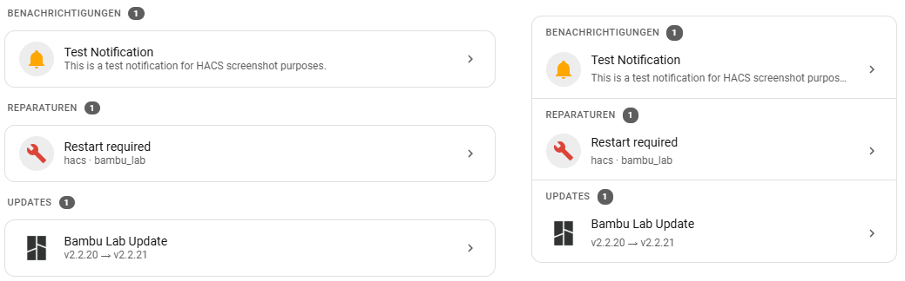

# System Notification Card

A unified card displaying system updates, persistent notifications, and active repairs in a sortable, expandable list.

[](https://github.com/hacs/integration)
[](https://github.com/thecodingdad/system-notification-card/releases)

## Screenshot



## Features

- Three sections: Updates, Notifications, Repairs
- Section visibility and ordering control
- Individual or card-per-item layouts
- Section headers with item counts
- Click-through to entity/issue details
- Collapsible sections
- Dark/light theme support
- Item icons and supporting text
- EN/DE multilanguage support

## Prerequisites

- Home Assistant 2026.3.0 or newer
- HACS (recommended for installation)

## Installation

### HACS (Recommended)

[](https://my.home-assistant.io/redirect/hacs_repository/?owner=thecodingdad&repository=system-notification-card&category=plugin)

Or add manually:
1. Open HACS in your Home Assistant instance
2. Click the three dots in the top right corner and select **Custom repositories**
3. Enter `https://github.com/thecodingdad/system-notification-card` and select **Dashboard** as the category
4. Click **Add**, then search for "System Notification Card" and download it
5. Reload your browser / clear cache

### Manual Installation

1. Download the latest release from [GitHub Releases](https://github.com/thecodingdad/system-notification-card/releases)
2. Copy the `dist/` contents to `config/www/community/system-notification-card/`
3. Add the resource in **Settings** → **Dashboards** → **Resources**:
   - URL: `/local/community/system-notification-card/system-notification-card.js`
   - Type: JavaScript Module
4. Reload your browser

## Usage

```yaml
type: custom:system-notification-card
title: System Status
layout: single
show_section_headers: true
section_order:
  - id: updates
    visible: true
  - id: repairs
    visible: true
  - id: notifications
    visible: true
```

## Configuration

### Card Options

| Option | Type | Default | Description |
|--------|------|---------|-------------|
| `title` | string | — | Card title |
| `layout` | string | single | Layout mode: `single` (one card) or `individual` (each item in own card) |
| `show_section_headers` | boolean | true | Display section headers with item counts |
| `section_order` | array | — | Section order and visibility |

### section_order Options

| Option | Type | Description |
|--------|------|-------------|
| `id` | string | Section ID: `updates`, `notifications`, or `repairs` |
| `visible` | boolean | Show/hide this section |

## Multilanguage Support

This card supports English and German.

## License

This project is licensed under the MIT License - see the [LICENSE](LICENSE) file for details.
